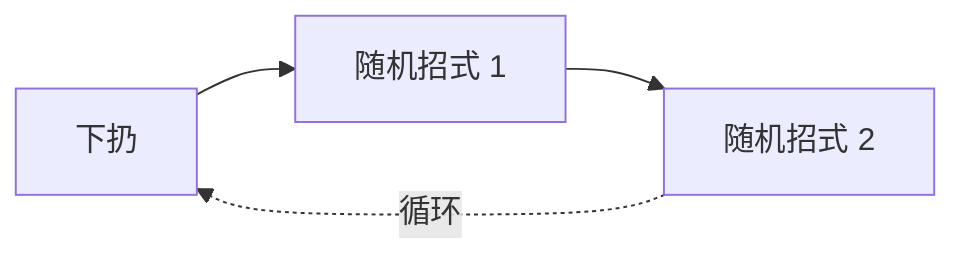
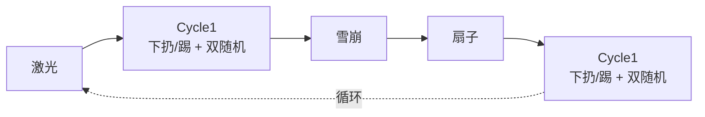
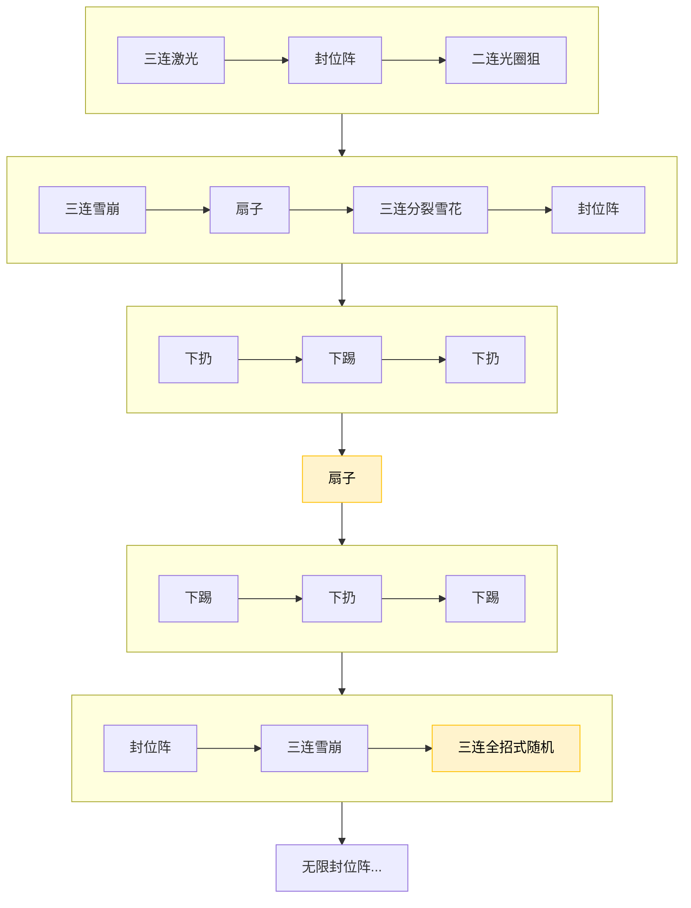

# **Rabi-Ribi BBH丽塔图文讲解**
:::tip
适用于帮助牢玩家们更好地理解丽塔，并提供一些实用的避弹技巧和输出方法。
 
 
本篇针对的环境是`Bex Bunny Hell`。
 

:::
---
## **行动模式**
在高速攻防的BBH环境下，如要进行避弹或输出，首先需要理解丽塔的行动模式，以便更好地应对各种攻击。

### **开局**
丽塔在开局时唯三的招式。
 
同时这三招也是常驻全局的随机招式，皆为`自机狙`。

`分裂雪花`
 
 

 
与丽塔保持一点距离开始微移，一般来说两轮莉波射击的时间（点射快速打满）过后，丽塔会重新进入自由行动状态，此时走锤起手单里3c再于落点双下锤（次一点就是下上锤）即可，莉波蓝蓄力能够延长对方恢复行动前的硬直。

:::info
这套连招是整场战斗的基本输出手法。此外，摸清后可以在正确的招式间隙抓准时机穿插双里三下锤提高输出。
:::
:::danger
注意，如需连续抓Boss不脱控，走锤起手应不超过两次下锤，站立双里可以三次，这是由Ch1后的Drill计数器机制决定的。
:::

`光圈狙`
 
 

 
单看是送的，但在BH的高速环境下是恶心的随机招式，零帧起手是常态，防不胜防。
 
此招不清除硬直抵抗，不建议在这招结束后立即抢输出，在随机期间每次连招结束后不宜进行大跨度的X轴移动，除非你知道下一招是什么，否则易撞体术。

`雪花阵`
 
 

雪花生成完毕后抓一套，注意雪花生成结束前打上去会卡肉。有时也不一定要抓身后落点，速降拉近再下锤也是可以的。

---
### 10%血线
:::tip 新招式`下扔`加入

 
适当拉开距离防止体术，丽塔起跳后回头速降抵近，躲避下扔的弹幕。
:::

从现在开始进入一个循环阶段，我们称之为`Cycle1`，招式顺序如下：

---
### 20%血线
:::tip 新招式`拖尾弹跳雪花`加入

:::

行动模式仍然是Cycle1，拖尾弹跳雪花从此时开始加入常驻随机库，此招同样不清除硬直抵抗，且极易与其他招式重叠，吃运气和随机应变。如果避弹条件允许，可以向丽塔落点靠近。
 
 
比起避弹，更建议的是把输出做好，减少这招出现的可能性。

---
### 27.5%血线
:::tip 新招式加入`下踢`加入

:::

行动模式仍然是Cycle1，下踢可替代下扔。
进入此阶段时必定先触发下踢，此后永久加入Cycle1，与下扔`交替`出现。

---
### 34%血线
:::tip 三个新招式加入
`激光`
 
 

 
激光柱首次缩小时进入内部，稍等片刻打双里控制，随后立即速降前进至另一侧再抓一套。
 
此处稍顿片刻是为了能控到放完招的丽塔，否则过早判定会清除硬直导致脱控。
 
 
`雪崩+扇子`
 
 

 
应对策略与分裂雪花或雪花阵类似
:::

进入此阶段，我们称之为`Cycle2`，不过这个阶段在输出足够的情况下循环存在感不强。
 
 
出招遵循固定顺序：

内部cycle1独立运行，无覆盖关系

---
### 50%血线
:::tip 两个新招式加入
`封位阵`
 
 

 
锤子防止收招体术
 
 
`三连雪崩`
 
 

 
:请输入文本
 
 
从版边开始引雪崩，剩下的加油吧，实战几乎就是必吃榜。
:::

进入该阶段立即进行`立绘攻击`（狙+底力交叉弹，就不放了），此后遵循固定顺序：

### 额外建议
:::info
在条件允许的情况下，各阶段`血线前`可以有意识地控制输出和对方招式节奏，尽量让伤害溢出到下一个阶段以降低随机性，并提高通过率。尤其对符后有重大意义，能少糟一招是一招。
:::
:::info
吃药时机一般选在封位阵起手前。
:::
## 参考视频
BH避弹项目首创者-Rivica的丽塔篇：
 
https://youtu.be/Di0REPJepPA?si=Uic7fIf7UTVIZplV
 
 
模仿者一号-超级高手DDV的片：
 
https://www.bilibili.com/video/BV1ftzvBtEAS
 
 
模仿者二号-什么是我啊，太菜就不特地放了。
 
 
希望下一员或下N员是你哦。